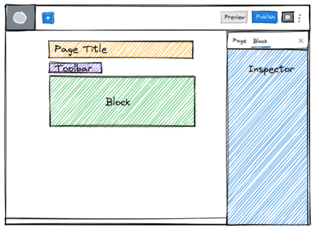

Blocks are the foundation of how we build WordPress sites at 10up. On most projects, we'll develop a bunch of custom blocks and also make customizations to the core blocks that come with WordPress.

This tutorial will walk you through the process of creating some simple custom blocks, as well as show you how to modify core blocks to fit your needs on projects. We'll start with some basics on how to get started, and work our way up to building a full-fledged custom block.


The very first thing you need to know about blocks is about the editor itself — let's start there!

## The block editor
Just so we're all on the same page with block terminology, here's all the important pieces of a block that you'll be dealing with:



1. <strong>Block</strong> — this refers to the core block(s) provided by WordPress, or the ones you develop from scratch for your projects.
2. <strong>Toolbar</strong> — the toolbar is the hoverable area above the block that contains block control buttons. These buttons can control from text alignment, block alignment, font styling, link handling, and more.
3. <strong>Inspector</strong> gets called a lot of different things — "Inspector Panel", "Sidebar", "Sidebar Inspector", etc. In Gutenberg language, it's simply known as the "Inspector".  This is where most of the customization options for blocks will be added.

Now that we have a handle on what things in the interface are called, let's jump into what blocks are made of.

## Block Attributes
Attributes are the heart of Gutenberg blocks. They're how WordPress stores data, and are the common thread between the editor and the frontend.

In our custom blocks, we define the attributes we want to use, save them to the database, and output them in our templates.

You can think about attributes as fields or data — a heading, a title, a description, a url, an array of Post IDs, an image ID, a boolean toggle, etc — are all common examples of attributes. In each of these instances, we want to save the attribute's value in editor and then output them in our templates.


## Anatomy of a block
It takes a village (of files) to build a block. Luckily, our 10up scaffold has everything neatly in place for you. The scaffold comes with a [starter block](https://github.com/10up/wp-scaffold/tree/trunk/themes/10up-theme/includes/blocks/example-block)
 that shows everything in place.

### The [10up Starter block](https://github.com/10up/wp-scaffold/tree/trunk/themes/10up-theme/includes/blocks/example-block)
The various pieces of this starter block are:
- [**block.json**](https://github.com/10up/wp-scaffold/blob/trunk/themes/10up-theme/includes/blocks/example-block/block.json) — this is where all of the configuration for our block happens. The block's name, icon, keywords and everything else is handled here. Most importantly, the block's attributes are listed here. We cover attributes in the next section.
- [**edit.js**](https://github.com/10up/wp-scaffold/blob/trunk/themes/10up-theme/includes/blocks/example-block/edit.js) —  This file controls how the block looks and behaves in the editor. This is where you use interactive elements to manage your block's attributes. Imagine you want to add a title to your block. In `edit.js`,  you'll import the RichText component, style it to look like it does on the frontend, and listen for changes. Any time the block changes, the data gets saved in the database! Markup in this file is written in JSX like standard React components.
- [**index.css**](https://github.com/10up/wp-scaffold/blob/trunk/themes/10up-theme/includes/blocks/example-block/index.css) — Sometimes you want your block to look slightly different in the editor than on the frontend. You can add styles to affect only the editor appearance here.
- [**index.js**](https://github.com/10up/wp-scaffold/blob/trunk/themes/10up-theme/includes/blocks/example-block/index.js) — this is where everything about the block is brought together. You shouldn't need to do much in this file beyond importing the edit and save functions and the block.json.
- [**markup.php**](https://github.com/10up/wp-scaffold/blob/trunk/themes/10up-theme/includes/blocks/example-block/markup.php) — Here's where the frontend markup for your block goes. Have a look at what's in `$args` to see what data is available to you. Any attributes that you've saved in the editor should be available here.
- [**register.php**](https://github.com/10up/wp-scaffold/blob/trunk/themes/10up-theme/includes/blocks/example-block/register.php) — This file registers our block. You shouldn't need to edit anything in this file except to update the namespaces (TENUP_THEME_BLOCK_DIR) and to add the name of your block
- [**save.js**](https://github.com/10up/wp-scaffold/blob/trunk/themes/10up-theme/includes/blocks/example-block/save.js) — You generally shouldn't need to touch this file. At 10up, we mostly use dynamic blocks which return `null`, but this isn't super-important at this stage. It's something you won't need to worry about until you do, and then it should make sense. We'll cover that situation in an example later.

## Putting it all together
There's a lot going on there, but things should make more sense if you follow a single attribute around.

Let's look at the `customTitle` attribute:
1. It's first defined as an attribute here in [block.json](https://github.com/10up/wp-scaffold/blob/trunk/themes/10up-theme/includes/blocks/example-block/block.json#L15). This is essentially saying "I want to store a field in the database called `customTitle`" and use it in my templates.

<pre>
{
	"title": "Example Block",
	"description": "An Example Block",
	"text-domain": "tenup-scaffold",
	"name": "tenup/example",
  	"icon": "feedback",
  	"category": "tenup-scaffold-blocks",
	"attributes":{
		<strong>"customTitle"</strong>: {˚
			"type" : "string"
		}
  } ...
</pre>

2. Then we wrap it in some markup and watch for changes in a `<RichText>` element in [edit.js](https://github.com/10up/wp-scaffold/blob/trunk/themes/10up-theme/includes/blocks/example-block/edit.js#L28).
```
	<div className={className}>
		<RichText
			className="wp-block-example-block__title"
			tagName="h2"
			placeholder={__('Custom Title')}
			value={currentTitle}
			onChange={(customTitle) => setAttributes({ customTitle })}
		/>
	</div>
```
3. Finally, we output our `customTitle` attribute in our frontend markup in [markup.php](https://github.com/10up/wp-scaffold/blob/trunk/themes/10up-theme/includes/blocks/example-block/markup.php#L29)!

```
<h2 class="wp-block-example-block__title">
	<?php echo wp_kses_post( $args['attributes']['customTitle'] ); ?>
</h2>
```

## Takeaways
That's a quick tour of the block editor, some of the common lingo, and a peek at an existing block. Let's quickly sumarise the most important takeaways.

1. Blocks live in the block editor. Most blocks have two places to control its settings: a **Toolbar** above them  and an **Inspector** in the right sidebar.
2. Blocks use and store **Attributes**. You can think of attributes in the same way you think of custom fields.
3. Our scaffolding has a specific structure for blocks. An example block ships with our [WP Scaffolding](https://github.com/10up/wp-scaffold/tree/trunk/themes/10up-theme/includes/blocks/example-block).

## Further Reading
1. [Block Editor Handbook](https://developer.wordpress.org/block-editor/)
