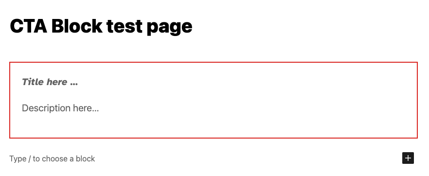
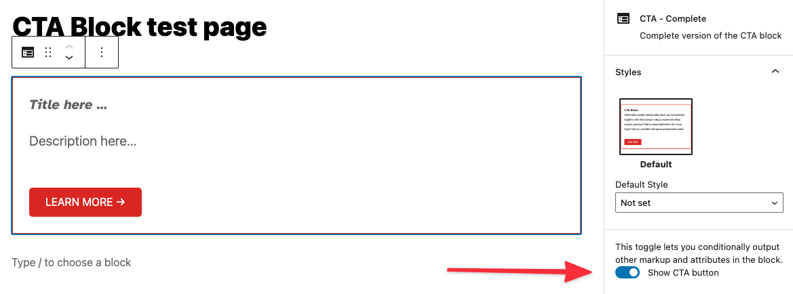

# Lesson 2: Creating a simple Block

This lesson provides a partially completed block in `/10up-theme/includes/blocks/cta-starter` that needs to have some features added to it to match the completed block in `10up-theme/includes/blocks/cta-complete`. All of the setup and files have been pre-configured as the focus here is to work with a block on its own without adding confusion around build tools and file locations.

If you are stuck or need help, refer to the `cta-complete` block as reference or reach out to `#10up-gutenberg` in Slack for help.

## Objectives:

1. Add new attributes to a block.
2. Use the RichText component and save the values to a block.
3. Add an Inspector Control to a block.
4. Display the attributes on the frontend.

Here is the completed CTA block that we are going to build:


## Get Started:
Go ahead and open your code editor if you have not already done so. Run the following command inside the `wp-content/themes/10up-theme` directory to start watching for file changes.
```
npm run watch
```

Also, open your browser and navigate to the existing `Hello World` post.
```
https://gutenberg-training.test/wp-admin/post.php?post=1&action=edit
```

## Tasks:

### 1: Add a new attribute: `description`
Add a new attribute to the `cta-starter/block.json` file that will store the `description` field. Attributes are how data is stored with a block. [Here is a link to the official docs for reference](https://developer.wordpress.org/block-editor/reference-guides/block-api/block-attributes/) and some more reading [here](https://developer.wordpress.org/block-editor/handbook/tutorials/create-block/attributes/). For reference, you can see the existing `title` attribute in the file. Don't forget to set the `type`!

```
"attributes": {
	"title": {
		"type": "string"
	},
	"description": {
		"type": "string"
	}
}
```

**BONUS:** Set the `example` output for `description`. For reference, you can see the existing `title` content under `example`.

```
"example": {
	"attributes": {
		"title": "CTA Block",
		"description": "Venenatis saepe perspiciatis illum qui voluptatum sagittis nihil litora ipsum sequi, eiusmod tellus soluta, pulvinar! Nemo exercitationem hic risus fugit! Omnis, proident tempora perspiciatis nulla.",
	}
}
```
###  2: Add a RichText component to manage the new attribute
We want the user to be able to enter the description and manage formatting of the text in the blocks `edit` property. To do that, we first need to be sure our attributes are listed in the top of the `ExampleBlockEdit` call in the the `cta-starter/edit.js` file. We need to be sure `description` is included in the `attributes` object below:

```
attributes: { title, ctaText, ctaLink, showCTALink },
	setAttributes,
```

Next, in the same file, we can add a `RichText` component under the existing one for the title. This component can receive many props ( [see the docs here for the full list](https://github.com/WordPress/gutenberg/tree/trunk/packages/block-editor/src/components/rich-text) ) but for now, we only need to specific the `tagName`, the `value` and `onChange`. Although not required, let's also add `className`, `placeholder`, and `keepPlaceHolderOnFocus`. If you use the existing `RichText` being used for the the `title` attribute, be sure to update the any references to the `title` attribute to the new one we created. Once you have the attribute being saved and retrieved correctly, move on to the next task!

**Hint**: Not sure what to use as values? Here you go:
* className="call-to-action-block__description"
* tagName="p"
* placeholder={__('Description here…', 'gutenberg-lessons')}
* keepPlaceholderOnFocus="true"
* value={description}
* onChange={(description) => setAttributes({ description })}
```
<RichText
	className="wp-block-cta-complete-__description"
	tagName="p"
	placeholder={__('Description here …', 'gutenberg-lessons')}
	keepPlaceholderOnFocus="true"
	value={description}
	onChange={(description) => setAttributes({ description })}
/>
```
To test your work, enter data into the `description` field in the Block Editor, save the post, and refresh your screen. Once you have the attribute being saved and retrieved correctly, move on to the next task!

**Note**: See that `setAttributes` call? That's a function that is provided by the block API to set attributes for the block you can read more about it [here](https://developer.wordpress.org/block-editor/reference-guides/block-api/block-attributes/)

**Note**: See that `keepPlaceholderOnFocus` prop? When an input receives focus, if this is set to "true", it keeps the placeholder text until there is an update by the editor.

### 3: Add an optional field to the block.
Now that we know how to add new attributes and use `setAttributes` to update them, we can create more complicated features - let's add an optional CTA button!

When we are done, it will look like this:


To do this, we need to manage three new pieces of data:
1. Is the CTA enabled?
2. The button text.
3. The button link.

Add three more attributes to the `cta-starter/block.json` file for each of the new pieces of data with a `default` value and the appropriate `type` as needed. ( Refer to `cta-complete/block,json` if you get stuck )
**Note: One of them is NOT of the the type `string`**

**HINT**: Attributes we are adding:
* `showCTALink`
* `ctaLink`
* `ctaText`

**BONUS:** Let's set some defaults for these new attributes:
* `ctaLink`: "https://10up.com"
* `ctaText`: "Learn more →"

**BONUS:** Set the "example" output for each of these new attributes!

```
"attributes": {
	"title": {
		"type": "string"
	},
	"description": {
		"type": "string"
	},
	"showCTALink": {
		"type": "boolean"
	},
	"ctaLink": {
		"type": "string",
		"default": "https://10up.com"
	},
	"ctaText": {
		"type": "string",
		"default": "Learn more →"
	}
}
```

Next, we will add a `ToggleControl` ( [docs](https://developer.wordpress.org/block-editor/reference-guides/components/toggle-control/) ) to the block's Inspector Sidebar. Be aware that there are many useful pre-built components like this one you can use when building a block. Reference the [pre-built components](https://developer.wordpress.org/block-editor/reference-guides/components/) before building a new component. The `InspectorControls` component has already been added to the `cta-starter/edit.js` file for you. It is a special type of component that uses a concept call SlotFill. This is how we can add the code next to the components, but have it appear in the block's Inspector Sidebar. All of the imports have already been setup for you so you can simply add the new `ToggleControl` component inside the `PanelBody` component (don't forget to add your new attributes to the `attribute` object at the top of the `ExampleBockEdit` call!). Set the props for the component to update the attribute that controls if the CTA is enabled ( Refer to `cta-complete/block,json` if you get stuck ).

**HINT**: place `ToggleControl` inside `PanelBody`:
```
<ToggleControl
	label={__('Show CTA button', 'gutenberg-lessons')}
	checked={showCTALink}
	onChange={() => setAttributes({ showCTALink: !showCTALink })}
/>
```

Once that is in-place, we will add a `URLInput` component to the Inspector Sidebar. This will allow the user to set the URL that the CTA button links to. The issue here, is that we only want to show this new control if the attribute that stores if the CTA is enabled is set to `true`. Give this a try and again refer to the completed example if you get stuck.

**HINT**
* We want to display the `URLInput` component just under our `ToggleControl` and *ONLY* if `showCTALink` is `true`. In React, we can do something like `{showCTALink && ( ... )}`
* `URLInput` component props:
	* label={__('URL', 'gutenberg-lessons')}
	* value={ctaLink}
	* onChange={(ctaLink) => {
		setAttributes({ ctaLink });
	}}
```
{showCTALink && (
	<URLInput
		label={__('URL', 'gutenberg-lessons')}
		value={ctaLink}
		onChange={(ctaLink) => {
			setAttributes({ ctaLink });
		}}
	/>
)}
```

The next step is to add a new `RichText` component below the one for the `description` field. This component will manage the text of the CTA button. Be sure that this is only shown if the feature is enabled. The component should set and retrieve the associated attribute correctly.

**HINT**
* Remember how we conditionally showed `URLInput` above? We can do the same thing for this new `RichText` component.
* NEW `RichText` component props:
	* className="call-to-action-block__link"
	* tagName="a"
	* placeholder={__('CTA here…', 'gutenberg-lessons')}
	* keepPlaceholderOnFocus="true"
	* value={ctaText}
	* onChange={(ctaText) => setAttributes({ ctaText })}
```
{showCTALink && (
	<RichText
		className="call-to-action-block__link"
		tagName="a"
		placeholder={__('CTA here…', 'gutenberg-lessons')}
		keepPlaceholderOnFocus="true"
		value={ctaText}
		onChange={(ctaText) => setAttributes({ ctaText })}
	/>
)}
```

__A quick note on block UX best practices:__ In general, content such as text or setting a featured image should be input into the actual block and "settings" such as the CTA on/off toggle should be in the Inspector Toolbar.
### 4: Display the attributes on the frontend.

The intention for any block we create at 10up is to have the Block Editor experience match the frontend experience as closely as possible. Update the `cta-starter/markup.php` file to show the new attributes correctly including the optional CTA button. Care must be taken in terms of your HTML markup and your CSS styles to ensure a consistent feel between the Block Editor and the frontend.

**HINT**
* Add `description`, and conditionally shown `ctaLink`.
* All data needed should be passed found in $attributes.
* Don't forget class names.

**NOTE**: You may see in the primary div in the class declaration the following: `<?php echo isset( $attributes['className'] ) ? esc_attr( $attributes['className'] ) : ''; ?>`. When a block is selected, within the block inspector controls (right sidebar), you will see a toggle for `Advanced` and, within that, an input to optionally add `Additional CSS class(es)`. This code included in the markup will display any custom / additional classes added here.

```
<p class="call-to-action-block__description">
	<?php echo wp_kses_post( $attributes['description'] ); ?>
</p>
<?php if ( isset( $attributes['showCTALink'] ) && true === $attributes['showCTALink'] ) : ?>
	<a href="<?php echo esc_url( $attributes['ctaLink'] ); ?>" class="call-to-action-block__link">
		<?php echo esc_html( $attributes['ctaText'] ); ?>
	</a>
<?php endif; ?>
```

## Optional Changes

Congratulations! You created a block that should look and function the same as the `cta-complete` block. For this part of the training, get creative and add your own features to the block. A few fun ideas are below:

1. Change the style of the block if the "Show CTA" toggle is enabled.
2. Convert the "Show CTA" toggle to a [radio control](https://developer.wordpress.org/block-editor/reference-guides/components/radio-control/).
3. Add a [checkbox control](https://developer.wordpress.org/block-editor/reference-guides/components/checkbox-control/) that allows the user to open the `LEARN MORE` button link in a new tab.


## Next Lesson

[Lesson 3: Block Styles](./03-styles.md)