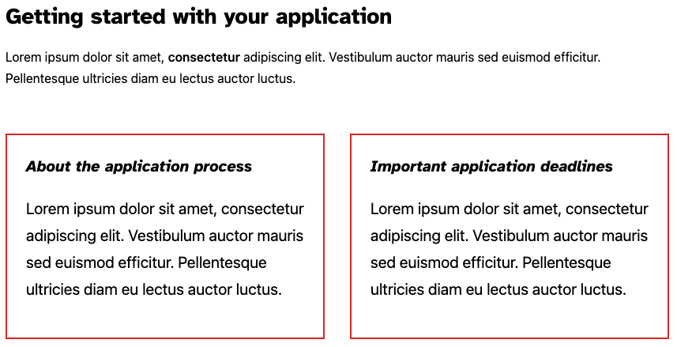
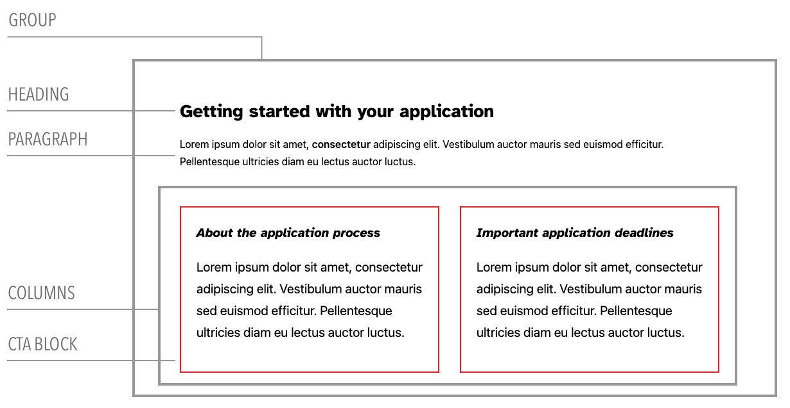
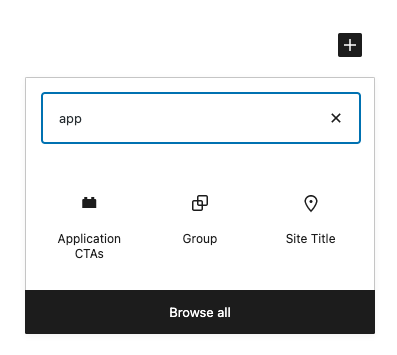
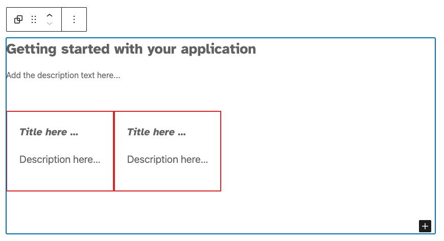
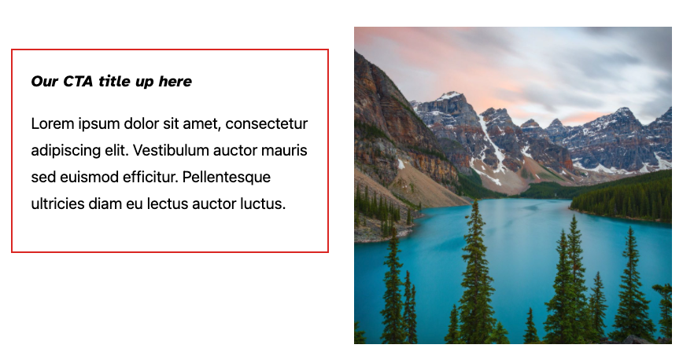
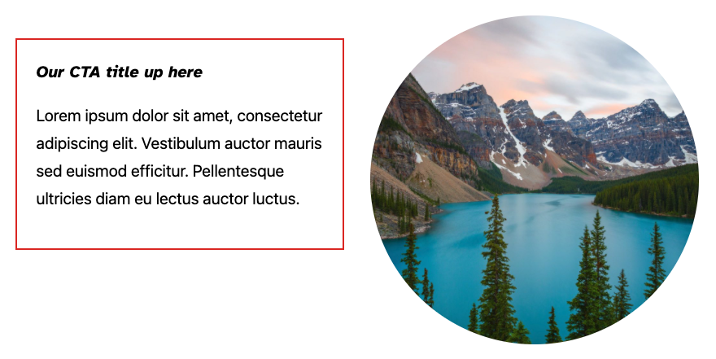

# Lesson 3: Block variations

In the last lesson, we learned how to add styles to blocks. In this lesson, we're going to learn how to organize core and custom blocks into patterns or variations for easy reuse.

## Learning Outcomes:

1. Learn what block variations are and how to use them
2. Learn how to register block variations
3. Learn how to combine core and custom blocks into reusable variations


## What are "block variations"?
[Block Variations ](https://developer.wordpress.org/block-editor/reference-guides/block-api/block-variations/) is the api that allows you to create blocks that are _similar_ to existing blocks, but have differences that you can define. You could create a variation of the Group block, for example, that has different attributes, pre-defined classnames, and even InnerBlocks.

## Exercise Overview
10up has a lot of clients in higher-ed. These clients obviously devote a lot of attention to the student application process. Imagine you're working with one of these clients and they want to re-purpose the work we did on the CTA block from [Lesson 1](02-cta-lesson.md). On most pages, they want to include this pattern of blocks: a heading, a description and two CTA blocks side by side. Here's what they want:



We need a way to "package up" all those elements so editors can easily insert it whenever they want. Thankfully we can, with block variations!

## Breaking it down
For our example, we need to combine these four blocks for easy use in the editor. Let's break down what we're looking at here into actual blocks:



On first glance, it looked like we just needed 4 blocks. But we actually need a couple of more for wrapping. Here's the breakdown:
1. A Group block to contain the whole thing
2. A Heading block
3. A Paragraph block
4. A Columns block to contain our CTA blocks
5. Our two CTA blocks

## Using Variations
Alright — let's build this thing! The completed example is in [application-ctas.js](../themes/10up-theme/includes/block-variations/application-ctas.js)
1. First, we need to register a new variation of the Group block:
```
registerBlockVariation('core/group', {
	name: 'application-ctas',
	title: 'Application CTAs',
	icon: 'block-default',
	scope: ['inserter'],
	attributes: {
		className: 'is-style-application-ctas',
	},
```
2. Next, we need to define some structure for our variation via `innerBlocks`. This is where the real magic happens:
```
innerBlocks: [
		[
			'core/heading',
			{
				level: 2, // IE: make it an <h2>
				placeholder: 'Getting started with your application',
			},
		],
		[
			'core/paragraph',
			{
				placeholder: 'Add the description text here...',
				className: 'application-ctas__description',
			}
		],
		[
			'core/columns',
			{},
			[
				['gutenberg-lessons/cta-complete', {}],
				['gutenberg-lessons/cta-complete', {}],
			],
		],
	],
```

3. You can see that we added a custom className on the description paragraph. You could do the same for any of the attributes that a block supports. [BlockBook](https://youknowriad.github.io/blockbook/block/) is an excellent resource for seeing what attributes are available on each block to use

4. Once we've registered the block, we can now see it in the inserter:


5. And here's our finished product:



## Takeaways
That's a quick look of block variations. Let's quickly sumarise the most important takeaways:

1. You can combine core and custom blocks into patterns or variations
2. You often need to group blocks together using Group and Column blocks
3. You can change the attributes of any blocks you use — adding classes, changing placeholder text, etc


## Next steps
1. Try to create a different layout. Perhaps a variation that places a CTA next to an image:


2. Try having it so that the rounded image is the one that displays by default with your variation:



## Further reading
* [Block Variations Handbook](https://developer.wordpress.org/block-editor/reference-guides/block-api/block-variations/)
* [Block Variations](https://css-tricks.com/how-to-use-block-variations-in-wordpress/)
* [BlockBook](https://youknowriad.github.io/blockbook/block/)
