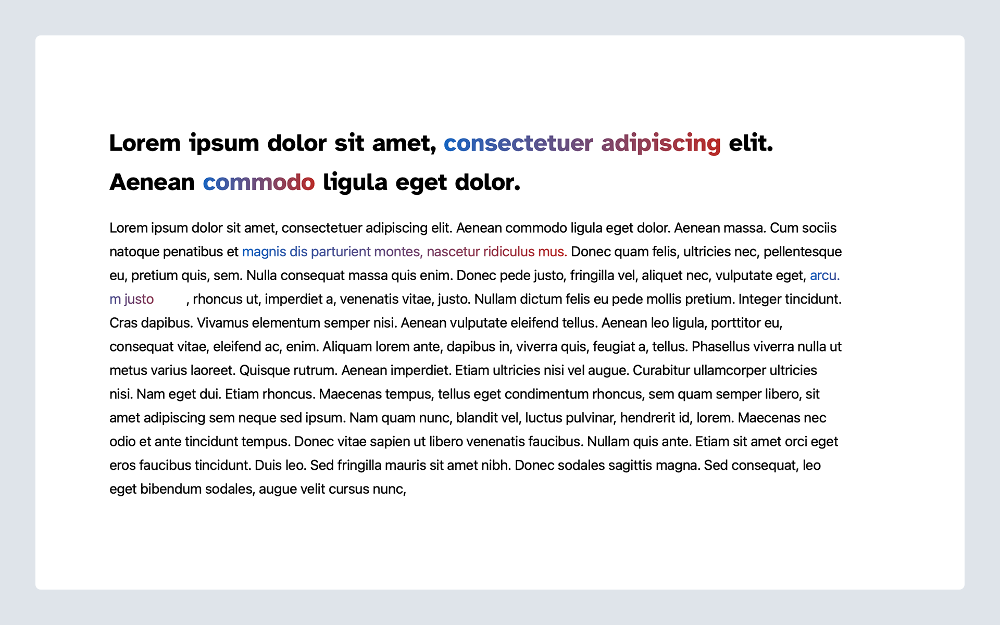

# Lesson 6: Rich Text Formats

## Learning Outcomes:
1. Learn what RichText Formats are
2. Understand how you can control them in RichText components
3. Build your own custom Rich Text Format

## What are "Rich Text Formats"?
Rich Text within WordPress is the underlying engine that powers the text editing capabilities in the new Editor. The way rich text works is by representing the text, whether it is an Element Tree (DOM), a HTML String, or a Plain Text string, as a Rich Text Object. Under the hood that representation looks something like this:

```js
{
  text: string,
  formats: Array,
  replacements: Array,
  ?start: number,
  ?end: number,
}
```

As you can see in this, the actual text is stored separately from the formatting. The formats are ranges within that text, which will get output with custom formatting. So this means that whenever you use a `RichText` component in the editor and select a piece of text to make it **Bold** or *Italic*, for example, you apply a Rich Text Format on that text selection. In turn, the format determines what should happen with that range of text.

Any format can either have a [HTML tag with text-level semantics](https://www.w3.org/TR/html5/textlevel-semantics.html#text-level-semantics-usage-summary) or a tag and class name to identify the format.

Core comes with a whole bunch of core Rich Text Formats. They are all created within their own package called [`format-library`](https://github.com/WordPress/gutenberg/tree/trunk/packages/format-library/src).


In the same way core adds all these core formats you are able to add your own custom formats and also remove the formats that core or another plugin created.

## When should you use "Rich Text Formats"
Rich Text Formats make sense to use whenever you want editors to be able to manipulate something inline - not on a block level. So the same way you can use the Core "Inline Image" to place a special inline element into your text, you can create your own format that adds a special inline element at the current cursor position. More commonly, you can add a custom format to apply to a range of text to wrap it in a special class name or inline html tag.

## Exercise Overview
Let's say we get the following design on a project:


The client wants to be able to highlight text across their site with a gradient text color. This should not be limited to specific blocks but be available for any text on the page.

To see this in action, spin up your local Gutenberg Training site, output some text, hightlight the text and click the down-arrow to the right of the link icon to reveal text formats. You will see `Gradient Complete` listed per our [`gradient-complete.js`](/themes/10up-theme/includes/text-formats/gradient-complete.js) component and can currently apply these styles as expected.

To set this up on our own, we will be using a prepopulated starter file for this component: [`gradient-starter.js`](/themes/10up-theme/includes/text-formats/gradient-starter.js).

What is included in our pre-setup:
- [`gradient-starter.js`](/themes/10up-theme/includes/text-formats/gradient-starter.js) contains all the imports that we need.
- The `Gradient Complete` and `Gradient Starter` files have both already been included in the [`text-formats/index.js`](/themes/10up-theme/includes/text-formats/index.js) file which is included in our `entry` block in the project [`package.json`](/themes/10up-theme/package.json) file.
- This file, when compiled into the project `/dist` directory, is enqueued in the [`core.php`](/themes/10up-theme/includes/core.php) file `text_formats()` function.

Next, in [`gradient-starter.js`](/themes/10up-theme/includes/text-formats/gradient-starter.js), we need to call the `registerFormatType` function with the correct information to register our format (we go through these steps below).


## Takeaways
Rich Text Formats are a great way to add inline formatting controls and therefore a great resource for anything that should not affect an entire block but anything inline.

Registering a Format works very similarly to registering a block. There are two parameters we need to pass to the `registerFormatType` function.
1. Every format needs to have a unique name. The formats are named the same way blocks are named with a `namespace` at the beginning followed by a `/` divider and the `name`.
2. Every format also needs to have some format options defined. For starters every format needs to have a `title` and a `tagName`. It optionally can have a `className` and or some inline `styles` and then it must have an `edit` method that defines the actual UI with which we interact.

In our case we don't need inline styling because we are only toggling on or off a gradient. So we can _just_ set the `className` to `has-text-gradient` and then our styles will get applied to that element.

So, to get this working, we want to do do the following in [`gradient-starter.js`](/themes/10up-theme/includes/text-formats/gradient-starter.js).

**NOTE**: if you get stuck, please compare with [`gradient-complete.js`](/themes/10up-theme/includes/text-formats/gradient-complete.js)

1. Add the `registerFormatType()` function below where we set the `const FORMAT_NAME` as so:

```js
registerFormatType( FORMAT_NAME, {

})
```

2. Within this function, we want to set our format options (`title`, `tagName`, and `className` to start):

```js
registerFormatType(FORMAT_NAME, {
	title: __('Gradient Starter'),
	tagName: 'span',
	className: 'has-text-gradient'
});

```

3. The `edit` method itself is a slot to render things in the Block toolbar in the formatting controls section. So we can directly use the `RichTextToolbarButton` component from the `@wordpress/block-editor` package. As props we get passed whether the format is currently active (`isActive`), the `value` of the format and an `onChange` handler that we need to call whenever we want to change the format. Directly manipulating the `value` of a stored rich text format isn't the best idea though. Formats are stored as complex objects with loads of metadata.

Let's start by adding our `edit` method to the `registerFormatType` function:

```js
registerFormatType(FORMAT_NAME, {
	title: __('Gradient Starter'),
	tagName: 'span',
	className: 'has-text-gradient',
	edit({ isActive, value, onChange }) {

	},
});

```

Per the above, we next want to add our `return` to include the `RichTextToolbarButton` component. Here, `onClick`prop. We will rig the `onClick` to a function `onToggle()` in the next step below:

```js
edit({ isActive, value, onChange }) {
	return (
		<RichTextToolbarButton
			onClick={onToggle}
		/>
	);
},
```

Luckily Core has created helper functions that can be imported from the `@wordpress/rich-text` package that allow you to more easily and safely manipulate the formats. In our case we only want to toggle the format and therefore can use the `toggleFormat` function.

In order to pass the information to the `onChange` function we get from the rich text format we need to do the following:

```js
onChange(
	toggleFormat(value, { type: FORMAT_NAME })
);
```

To add this to our component, we need to wrap that in a function (here we are using `onToggle()`) and then assign that to the `onClick` event of the `RichTextToolbarButton`:

```js
edit({ isActive, value, onChange }) {
	const onToggle = () => {
		onChange(
			toggleFormat(value, {
				type: FORMAT_NAME,
			}),
		);
	};
	return (
		<RichTextToolbarButton
			onClick={onToggle}
		/>
	);
},

```

Now all that is left is adding a proper icon (using [`GradientIcon`](/themes/10up-theme/includes/text-formats/icons.js) imported in the top of [`gradient-starter.js`](/themes/10up-theme/includes/text-formats/gradient-starter.js)) and a title to the `RichTextToolbarButton` and passing the `isActive` value to the `isActive` prop and we are done:

```js
return (
	<RichTextToolbarButton
		icon={GradientIcon}
		title={__('Gradient Starter')}
		onClick={onToggle}
		isActive={isActive}
	/>
);

```

Finally, we should be able to see our custom version of the gradient text format available to us in the editor. Spin up your local Gutenberg Training site, output some text, hightlight the text and click the down-arrow to the right of the link icon to reveal text formats. You will see `Gradient Starter` component and apply these styles as expected. Well done!

## Next steps
1. Take a look at a more complex rich text format like the "text-color" format from core: [Text Color Rich Text Format](https://github.com/WordPress/gutenberg/blob/trunk/packages/format-library/src/text-color/index.js)
2. Try to change our simple gradient toggle to allow editors to modify the gradient or pick from a predefined list of gradients in a popover like core does in the "text-color" format.

## Further reading
- [Block Editor Handbook: Introduction to the Format API](https://developer.wordpress.org/block-editor/how-to-guides/format-api/)
- [How to Create Custom Text Formats for Gutenberg Block Editor - by Jeffrey Carandang](https://jeffreycarandang.com/how-to-create-custom-text-formats-for-gutenberg-block-editor/)

## Next Lesson
[Lesson 7: Slot Fill](./07-slot-fill.md)
